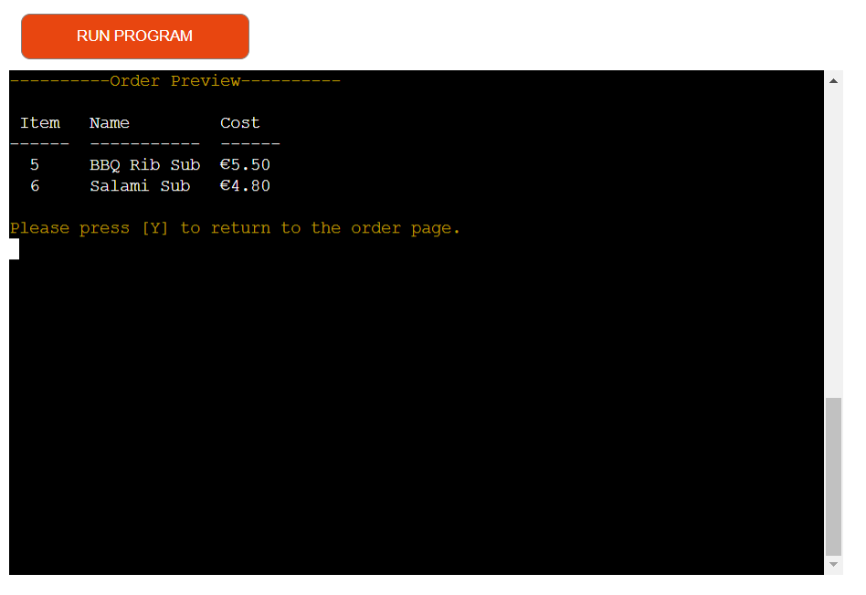

# The Cafe Beats

### Developer: Dhvani Intwala

The Cafe beats website has been developed to provide users the chance to order food for delivery or pick-up via a command line based interface.

[View live website]()

# Table of Contents

1. [Project Goals](#project-goals)
    1. [User Goals](#user-goals)
    2. [Site Owner Goals](#site-owner-goals)
2. [User Experience](#user-experience)
    1. [Target Audience](#target-audience)
    2. [User Requirements and Expectations](#user-requirements-and-expectations)
    3. [User Stories](#user-stories)
    4. [Site Owner Stories](#site-owner-stories)
    5. [User Manual](#user-manual)
3. [Technical Design](#technical-design)
    1. [Structure](#structure)
    2. [Flowchart](#flowchart)
    3. [Data Models](#data-models)
4. [Technologies Used](#technologies-used)
    1. [Coding Languages](#coding-languages)
    2. [Frameworks and Tools](#frameworks-and-tools)
    3. [Libraries](#libraries)
5. [Features](#features)
    1. [Existing Features](#existing-features)
    2. [Future Implementations](#future-implementations)
6. [Python Validation](#python-validation)
7. [Testing](#testing)
    1. [Browser Compatibility](#browser-compatibility)
    2. [Manual Testing](#manual-testing)
        - [Site user stories](#site-user-stories)
        - [Site owner stories](#site-owner-stories)
8. [Bugs](#bugs)
9. [Deployment](#deployment)
10. [Credits](#credits)
11. [Acknowledgements](#acknowledgements)

## Project Goals

### User Goals
- Be able to easily interact with the app to order food for    pick up or home delivery.
- Navigate the app seamlessly.
- Receive clear instructions on their current input options.
- Be able to add and remove items from an order prior to order confirmation.
- Be able to cancel the order.
- The ability to preview their order.
- Be able to quit the app from any page.

### Site Owner Goals

- Provide potential customers an easy-to-use app to order food from the cafe beats.
- To save the user information and order data to a Google Sheets worksheet.

## User Experience

### Target Audience

- People looking to have food ordered for delivery.
- People looking to pick up food from the store.

### User Requirements and Expectations

- The ability to seamlessly navigate through the app.
- To have a well organized menu.
- To have a easy ordering process.
- To have validation that inputs have been successfully entered.

### User stories

-  As a user, I want to be provided with clear instructions throughout the app.
- As a user, I want to be able to choose between order pick up or delivery.
- As a user, I want to be able to view the menu.
- As a user, I want to be able to add items to my order.
- As a user, I want to be able to remove items from my order.
- As a user, I want to be able to preview an order.
- As a user, I want to be able to cancel an unplaced order.
- As a user, I want to be able to place an order.
- As a user, I want to be shown a receipt.
- As a user, I want to be able to exit the app.

### Site Owner Stories

- As a site owner, I would want users to be greeted with a welcome message to give a friendly feel to the app.
- As a site owner, I would want to save the user information and order data to a Google Sheets file.
- As a site owner, I would want users to get feedback based on their input.

### User Manual

Instructions

#### Overview

The Cafe beats app is for users who wish to place orders for home delivery / pickup.

----

#### Welcome page

The welcome page opens with the store name "The Cafe Beats". A welcome page greets the users and asked if they would like to make an order. Users will be provdided with 2 options: Yes and No. Selecting yes will take the user to the main screen while selecting no will exit the app.

----

#### Main page

The purpose of the main page is to get the user details. Users are asked to provide their name and choice of delivery type. If a home delivery option is selected then home address is also asked.

----

#### Menu Page

On the Menu page users are provided with a table format of the menu with the range of items available for order. Users will be provdided with five options.

- Item number - To add the item to the order, users will be provided with feedback showing their selected item has been added to the order list and also a warning message if an invalid input has been entered.
- [P] - To preview the current order.
- [R] - To remove item number.
- [C] - To confirm order.
- [Q] - To cancel order, view thank you message and exit the app.

#### Preview page

The preview page shows the user selected order list in a table format. The table shows the item details like item name and price. Also it provides user the option to return to the menu page by pressing "Y".

#### Confirm order page

The user can confirm the order by entering "c", then confirm page is open where the user is asked "Are you ready to complete your order?" With two option's either the user can press "y" and confirm the order or the user can press "n" and again place the order.

#### Receipt page

When the user places the order then the receipt page opens where the user can see -
user name, order ID, order type, address, item ordered, total price, and at what time the order will be ready.

#### Thank you page

From the receipt page, the user can quit by pressing "q" and then the thank you page appears where Thanks for visiting is being displaced.

## Technical Design

### Structure

This app was designed using Code Institutes Python Essentials Template. The template creates a command line interface within a blank page with a run button located above the command line interface. As this project is only intended for use on large screen devices there was no need to incorporate responsiveness to the page. On arrival to the page, the user will be presented with a welcome message and instructions on user input choices.

### Flowchart

The following flowchart was created to help identify functions that would be required in the Python files.

Overview

### Data Models

- Lists and Sets- This project uses lists and sets to aid the storage of data from the Google Sheets file to variables and vice versa.

- Google Sheets API - Google Sheets was used in this project to store all required data outside the container.

## Technologies Used

### Coding Languages

- Python 3 - Used to create the command line based app.

### Frameworks and Tools

- Git - Used for version control.
- GitHub - Used to deploy the projects code.
- Gitpod - Used to develop and test code.
- Smartdraw used to create the project flow.
- Google Sheets - Used to store data outside of the program with the User data, food menu and sales records stored on separate worksheets.
- Google Cloud Platform - Used to manage access permissions to google services such as google autho and google sheets.
- Heroku Platform - Used to deploy the live project.
- PEP8 - Used to validate code against Python conventions

## Libraries

### Python Libraries

- os - Used to determine operating system and clear CLI.
- time - Used to create a delay effect.
- datetime - Used to get current time stamp and assign times to orders.

### Third Party Libraries 

- tabulate - I used this library to output lists in a table format enhancing user experience and overall readability.

- termcolor - I used this library to give colour to user feedback and instructions.

- pyfiglet - I used this library to generate the text art messages.

- gspread - I used this library to add, remove and manipulate data within my Google Sheets worksheets and to interact with Google APIs

- google.oauth.service_account - I used this library to set up the authentication needed to access the Google API and connect the Service Account using the Credentials function. From this a cred.json file was generated with all details needed for the API to access the Google account. This information is then stored in the config var section when deploying to Heroku.

## Features

### Existing features

#### Welcome message

The welcome message is featured on the home page and will greet users with a friendly message.

Welcome message image

#### Welcome message invalid input feedback 

The welcome message invalid input feedback is featured on the welcome page and will alert users of an invalid option entry.

Welcome message invalid input feedback

#### User Name and delivery type option

This page asks users to provide their name. Once user provies the name, a hi message displayed with user's name and devlivery type options. one option is home delivery and another is pickup.
pickup will auto populate the address as 'The Cafe Beats'. For home delivery, customers will be asked to enter their address.

User details type option

#### Invalid delivery type feedback

If user input is other than 'D' and 'P', a invalid delivery type feedback is displayed.

Delivery type image

#### Menu 

The Menu feature will display a tabulated format of all items available for order. The menu has five options: Add item, preview order, remove item, condirm order, quit.

Menu image

#### Add item to order

The Add item to order feature on the Menu page allows users to add an item to their order by typing the relevant item number as displayed on the menu.

Add item to order image

#### Invalid item for order

The Invalid item feature on the Menu page warns users that their previously entered input is not valid.

Invaild food item number image

#### Preview order
The preview order feature on the Menu page allows users to preview the items currently added to their order.

Preview order image

#### Remove item
The remove item feature on the menu page allows users to remove any selected item from user's order list.

Add item to order image

#### Confirm order
The confirm order is a feature that will allow users to confirm the order and allows us to generate the receipt.

Add item to order image

#### Display order receipt
This feature is displayed upon order completion. It includes all information which had been gathered throughout the process such as user name, delivery type, address and item ordered.

Add item to order image

#### Delivery charge
This feature adds a delivery cost if the order is for delivery and adds nothing if it is for pickup.

Add item to order image

#### Display order / delivery time
This feature displays the order time and delivery / pickup time on the order receipt.

Add item to order image

#### Quit
This feature is used to allow the user to quit the app with a thank you message.

Quit image

### Future Implementations

In the future, I would like to implement the following features:

- The user can also download a pdf and they will also receive an order confirmation email with a receipt.
- The user can also write feedback and review food and services.
- Users can also make their account and can log in.

## Python Validation

Python file - run.py

## Testing 

### Browser Compatibility

The website was tested on the following web browsers:

- Google Chrome (Version 104.0.5112.102)
- Microsoft Edge

### Manual Testing

#### Site User Stories

1. As a user, I want to be provided with clear instructions throughout the app.

| Feature       | Action        | Expected Result  | Actual Result |
| ------------- | ------------- | -------------    | ------------- |
| All listed features in the Features section provide the user with feedback based on user input | As prompted, enter user input | User to be provided with positive and negative feedback based on user input | Works as expected |

2. As a user, I should get an option to choose my order between pickup or home delivery.

| Feature       | Action        | Expected Result  | Actual Result |
| ------------- | ------------- | -------------    | ------------- |
| Order type options | Enter desired order type by entering D for home delivery or P for pickup | If order type Home Delivery is selected then the address is asked | Works as expected |

3. As a user, I want to view a clear and well-structed menu.

| Feature       | Action        | Expected Result  | Actual Result |
| ------------- | ------------- | -------------    | ------------- |
|Menu | Enter data when asked for name, address and delivery type | Menu and options to be displayed to the user  |Works as expected |

4. As a user, I want to add an item to the order list. Additionally have the option to remove items from order list.

| Feature       | Action        | Expected Result  | Actual Result |
| ------------- | ------------- | -------------    | ------------- |
| Add item to order list | Enter item number on menu page | User input item to be validated and added to the order list with confirmation message |Works as expected |
| Remove item from order list | From the menu page enter 'R' to remove the last item added to the order | User input item to be validated and removed from the order list with confirmation message |Works as expected |

5. As a user, I want to be able to preview an order.

| Feature       | Action        | Expected Result  | Actual Result |
| ------------- | ------------- | -------------    | ------------- |
| Preview order |From the menu enter 'P' to preview the order displaying all items previously added | User to be provided with a table of currently selected items for order  | Works as expected |

6.  As a user, I want to be able to exit the app.

| Feature       | Action        | Expected Result  | Actual Result |
| ------------- | ------------- | -------------    | ------------- |
|   Quit   |  Follow the process to complete an order, and from the Order Receipt display enter 'Q' to exit the app  | App to exit upon user entering Q and display and thank you message and the developers Social URLs     |Works as expected  |

7. As a user, I want to be shown a receipt.

| Feature       | Action        | Expected Result  | Actual Result |
| ------------- | ------------- | -------------    | ------------- |
| Display receipt  | From the menu enter 'C' to confirm the order. When prompted, confirm the order by selecting Y to View displayed Order receipt  | Upon order completion a formatted page of order summary will be displayed to the user   | Works as expected |

#### Site owner stories

1. As a site owner, I want users to be greeted with a welcome message to give the app a friendly experience.

| Feature       | Action        | Expected Result  | Actual Result |
| ------------- | ------------- | -------------    | ------------- |
|  Welcome message  | Run the app   | Title of website and welcome message to be displayed  |Works as expected  |

2. As a site owner, I want to save the user information and order data to a Google Sheets file.

| Feature       | Action        | Expected Result  | Actual Result |
| ------------- | ------------- | -------------    | ------------- |
| Retrieve data | Add user details on main page | Menu is tabulated after retrieving data from worksheet 'menu' | Works as expected |
|Append user data | Add item on menu page | User data and order data provided by the user during the order process is appended to the worksheet 'order_list' | Works as expected |

3. As a site owner, I want the status of the order in Google Sheets worksheet 'order_list' is automatically updated based on user action.

| Feature       | Action        | Expected Result  | Actual Result |
| ------------- | ------------- | -------------    | ------------- |
| Update order status  | Enter item number on menu page | User data & order data for the requested item number is appended to the worksheet 'order_list' and order status of the requested item is set to 'Processing'.| Works as expected |
| Update order status | Enter 'C' from menu page | In worksheet 'order_list', order status for the items of the specific order id changes to 'Confirmed'.  | Works as expected |
| Update order status | Enter 'Q' from menu page | In worksheet 'order_list', order status for the items of the specific order id changes to 'Cancelled'.  | Works as expected |

4. As a site owner, I want users to receive feedback based on their input.

| Feature       | Action        | Expected Result  | Actual Result |
| ------------- | ------------- | -------------    | ------------- |
| Welcome message invalid input | Enter an invalid option on Welcome screen  | User to be provided with feedback about invalid input | Works as expected  |
| Order type options | User input on main page | Shows positive or negative feedback based on user input | Works as expected |
| Menu | User input on menu page | Shows confirmation message for valid input and invalid message for invalid input | Works as expected |
| Preview order | Add an item in the order list and then enter 'P' to go to preview | Preview page is shown with user inputs| Works as expected |
| Receipt | Confirm user order on menu page | Upon order completion a formatted page of order summary is displayed | Works as expected  |
| Quit | Enter 'Q' on menu page | User exits the app with a thank you message | Works as expected |

## Bugs

| Bug     | Fix       | 
| --------| ------------| 
| Error in converting from string to float |  White space and € sign was removed and string slice was used to convert to float |
| When user removes an item on menu page, local variable order Id was not matching with worksheet Order ID | In remove item function  earlier row[J+4] was written and then it was changed to row[4] ,reason for doing this was to access the 4th element from the list|
| Append order confirmation function updates order status for only one item instead of all the items for the specific user in the worksheet 'order_list'  | Use findall function instead of find function for finding user specific order data  |

## Deployment
This project was deployed to Heroku with following steps:
1. Use the "pip freeze -> requiremnts.txt" command in the terminal to save any libraries that need to be installed in the file.
2. Navigate to https://www.heroku.com/ and login or create an account. 
3. Click the "new" button in the upper right corner and select "create new app".

Screenshot

4. Choose an app name and your region and click "Create app".

Screenshot

5. Under Config Vars store any sensitive data you saved in .json file. Name 'Key' field, copy the .json file and paste it to 'Value' field. Also add a key 'PORT' and value '8000'.

Screenshot

6. Go to the "settings" tab, add the Python build pack and then the node.js build pack (please note they need to be in the correct order of Python above node.js).

Screenshot

Screenshot

7. Go to the "deploy" tab and pick GitHub as a deployment method.

Screenshot

8. Search for a repository to connect to and select the branch you would like to build the app from.

Screenshot

9. If preferred enable automatic deploys and then deploy branch.

10. Wait for the app to build and then click on the "View" link which will redirect you to the deployed link.

### Forking the GitHub Repository

We can make a copy of the original repository on our GitHub account to view or make changes too without affecting the original repository, this is known as forking. Forking in GitHub can be done via the following steps:

1. Navigate to www.github.com and log in.
2. Once logged in navigate to the desired [GitHub Repository](https://github.com/jkingportfolio/CI_PP3_Taco_Trailer) that you would like to fork.
3. At the top right corner of the page click on the fork icon.
4. There should now be a copy of your original repository in your GitHub account.

Please note if you are not a member of an organisation on GitHub then you will not be able to fork your own repository.

### Clone a GitHub Repository

You can make a local clone of a repository via the following steps: 

1. Navigate to www.github.com and log in.
2. Once logged in navigate to the desired [GitHub Repository](https://github.com/jkingportfolio/CI_PP3_Taco_Trailer) that you would like to clone.
3. Locate the code button at the top, above the repository file structure.
4. Select the preferred clone method from HTTPS. SSH or GitHub CLI then click the copy button to copy the URL to your clipboard.
5. Open Git Bash
6. Update the current working direction to the location in which you would like the clone directory to be created.
7. Type `git clone` and paste the previously copied URL at Step 4.
8. `$ clone https://github.com/jkingportfolio/CI_PP3_Taco_Trailer`
9. Now press enter and the local clone will be created at the desired local location

## Credits

I used following resources during the project development:

- For Gspreds functions for retrieving and updating the data from and to google sheets [Gspread Documents](https://docs.gspread.org/en/latest/user-guide.html)

- For finding common elements in two lists using sets  
    https://www.geeksforgeeks.org/python-print-common-elements-two-lists

- A tutorial on the use of the tabulate module for displaying table data from pyeng.io was used - [Tabulate](https://pyneng.readthedocs.io/en/latest/book/12_useful_modules/tabulate.html)

## Acknowledgements

I would like to also thank the following:

- My Code Institute mentor Mr Akshat Garg for his guidance through this project.
- My fellow Code Institute students from whom I got the project idea.
- My Brother for his support in debugging.
- Code Institute tutor support who helped me with different issues while doing the project.

[Back to Top](#the-cafe-beats)

